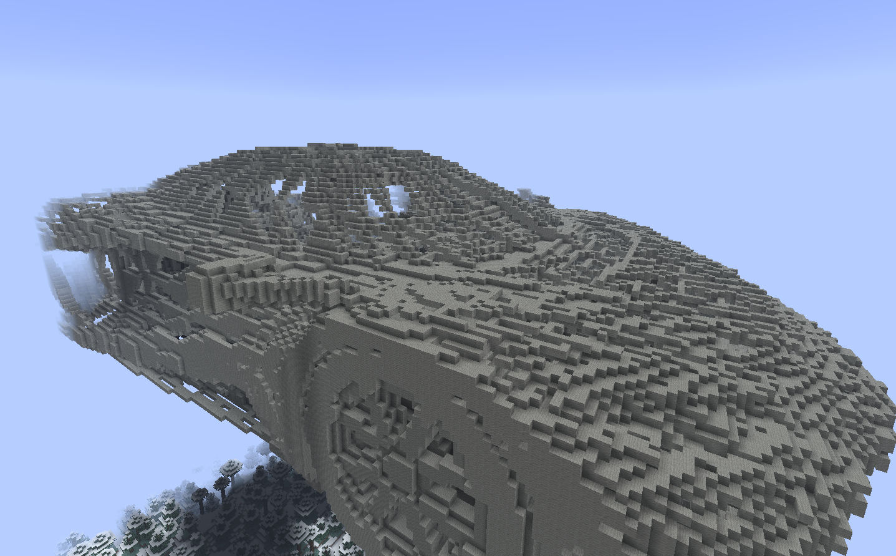
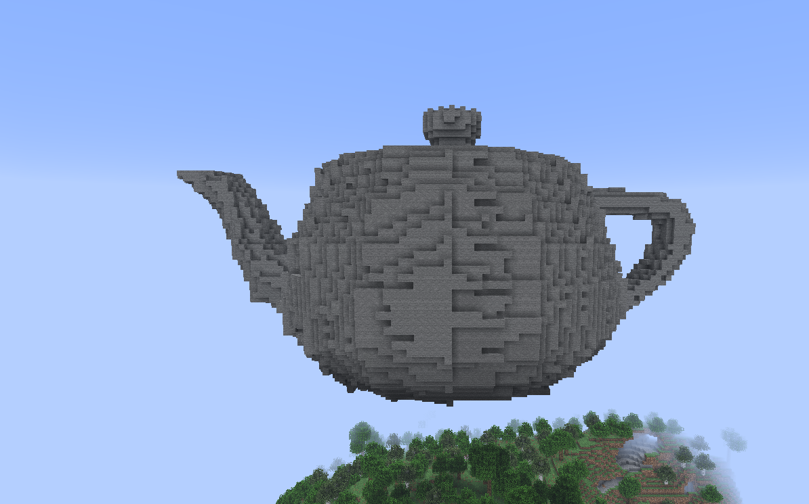

# obj2schem
Convert .obj models to Minecraft schematics using CUDA acceleration. Outputs a Sponge V3 format schematic.

## How it Works
Loads your .obj and material files, then rasterizes the mesh into a voxel grid on the GPU. Each voxel samples the model's texture and gets matched to the closest Minecraft block by average color. The result gets written as a .schem file that you can import into WorldEdit.

## Screenshots
| Car | Teapot | Ibuki |
| :---: |:---:|:---:|
|  |  |  |

## Requirements
- NVIDIA GPU with CUDA support
- [CUDA Toolkit](https://developer.nvidia.com/cuda-toolkit)
- [CMake](https://cmake.org/download/) 3.18+
- C++17 compiler
- [zlib](https://zlib.net/)

## Building
```bash
git clone https://github.com/Briiqn/obj2schem.git
cd obj2schem
mkdir build && cd build
cmake ..
cmake --build . --config Release
```
The binary will be in the `build/` directory.

## Usage
```bash
./obj2schem <input.obj> <output.schem> [scale] [textures_dir] [mode]
```
- `<input.obj>` - your model file
- `<output.schem>` - where to save the schematic
- `[scale]` - longest axis in blocks (defaults to 100)
- `[textures_dir]` - block textures folder (defaults to ./textures)
- `[mode]` - rasterization mode:
  - `fast` (default) - Bresenham wireframe + scanline fill
  - `quality` - conservative rasterization

**Examples:**
```bash
./obj2schem ../models/car.obj red_car.schem 250 ../textures fast
./obj2schem ../models/teapot.obj teapot.schem 150 ../textures quality
```

## Rasterization Modes
**fast:** Uses 3D Bresenham for edge drawing and scanline filling. Faster but you may have directional bias and small gaps.

**quality:** Conservative rasterization tests every voxel in triangle bounding boxes. Slower but guarantees complete coverage with no holes.

## Note
The texture directory should contain pngs named after block ids (e.g., `stone.png`, `oak_planks.png`).
